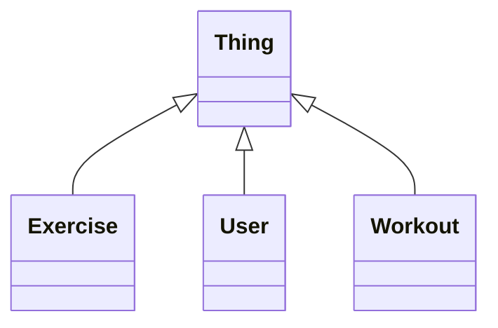
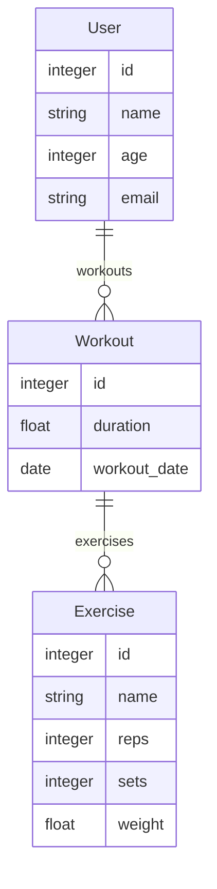
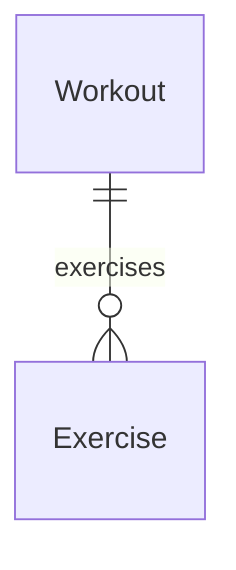
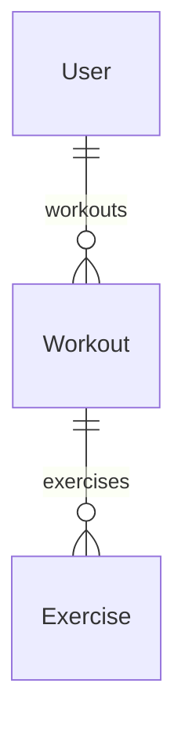

# FITNESS-APP

**metamodel version:** 1.7.0

**version:** 0.0.1

Schema for the fitness tracking platform

## Class Diagram

## ERD Diagram

## Base Classes

Foundational classes in the hierarchy (root classes and direct children of Thing):

| Class | Description |
| --- | --- |
| [Exercise](#exercise) | Individual exercise performed |
| [Thing](#thing) | The root class for all entities in the fitness app |
| [User](#user) | A registered app user |
| [Workout](#workout) | A recorded workout session |

## Classes

### Exercise

Individual exercise performed

#### Attributes

| Name | Cardinality: | Type | Description |
| --- | --- | --- | --- |
| **[id](#id)** | 0..1 | integer |  |
| **[name](#name)** | 0..1 | string |  |
| **[reps](#reps)** | 0..1 | integer |  |
| **[sets](#sets)** | 0..1 | integer |  |
| **[weight](#weight)** | 0..1 | float |  |

#### Parents

 * [Thing](#thing) - The root class for all entities in the fitness app

#### Referenced by:

 *  **[Workout](#workout)** : exercises  0..\* 

### Thing

The root class for all entities in the fitness app

#### Local class diagram

#### Attributes

| Name | Cardinality: | Type | Description |
| --- | --- | --- | --- |
| **[id](#id)** | 1..1 | integer |  |

#### Children

 * [Exercise](#exercise) - Individual exercise performed
 * [User](#user) - A registered app user
 * [Workout](#workout) - A recorded workout session

### User

A registered app user

#### Attributes

| Name | Cardinality: | Type | Description |
| --- | --- | --- | --- |
| **[id](#id)** | 1..1 | integer |  |
| **[name](#name)** | 0..1 | string |  |
| **[age](#age)** | 0..1 | integer |  |
| **[email](#email)** | 0..1 | string |  |
| **[workouts](#workouts)** | 0..\* | [Workout](#workout) |  |

#### Parents

 * [Thing](#thing) - The root class for all entities in the fitness app

### Workout

A recorded workout session

#### Attributes

| Name | Cardinality: | Type | Description |
| --- | --- | --- | --- |
| **[id](#id)** | 1..1 | integer |  |
| **[duration](#duration)** | 0..1 | float |  |
| **[exercises](#exercises)** | 0..\* | [Exercise](#exercise) |  |
| **[workout_date](#workout_date)** | 0..1 | date |  |

#### Parents

 * [Thing](#thing) - The root class for all entities in the fitness app

#### Referenced by:

 *  **[User](#user)** : workouts  0..\* 

## Slots

| Name | Cardinality/Range | Used By |
| --- | --- | --- |
| **id** | 1..1 integer | [Exercise](#exercise), [Thing](#thing), [User](#user), [Workout](#workout) |
| **name** | 0..1 string | [Exercise](#exercise), [User](#user) |
| **age** | 0..1 integer | [User](#user) |
| **duration** | 0..1 float | [Workout](#workout) |
| **email** | 0..1 string | [User](#user) |
| **exercises** | 0..\* [Exercise](#exercise) | [Workout](#workout) |
| **reps** | 0..1 integer | [Exercise](#exercise) |
| **sets** | 0..1 integer | [Exercise](#exercise) |
| **weight** | 0..1 float | [Exercise](#exercise) |
| **workout_date** | 0..1 date | [Workout](#workout) |
| **workouts** | 0..\* [Workout](#workout) | [User](#user) |

